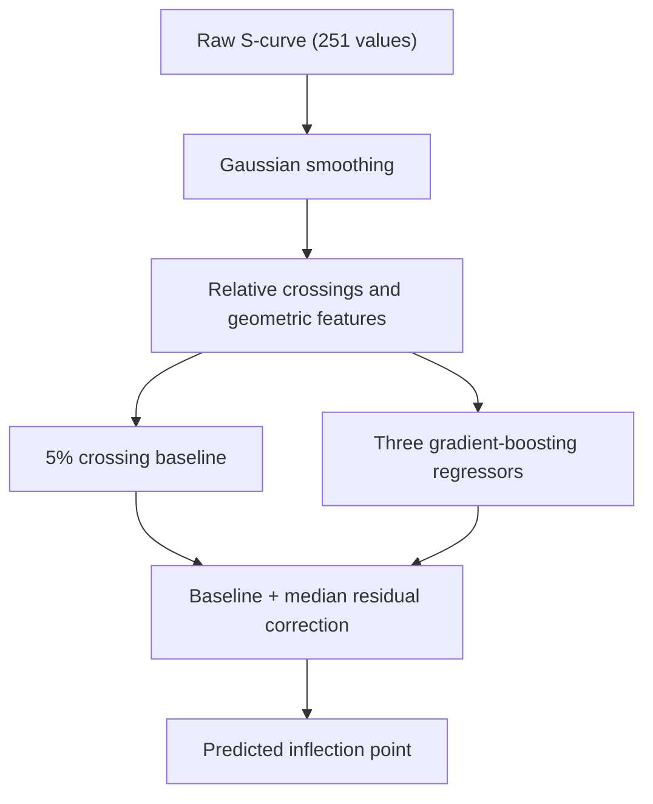

# X-ray Detector Calibration with Physics-Guided Residual Learning

A signal-processing and gradient-boosting pipeline for predicting the inflection
points of hybrid pixel detector S-curves.

**Official Codabench result:** **0.447879 MSE**, **0.669237 DAC RMSE**, and
**0.992113 R²** on a hidden test set of **45,860 S-curves**.

This project was developed for the
[X-ray Detector Calibration Using ML — DataCamp 2025](https://www.codabench.org/competitions/12117/)
challenge.

## Problem

Hybrid pixel X-ray detectors contain thousands or millions of independently
operating pixels. Manufacturing variations cause the effective electronic
threshold to differ from one pixel to another, which can reduce image quality.
Each pixel therefore needs to be calibrated.

During calibration, the detector is exposed to a monochromatic X-ray beam while
the applied threshold is varied. This produces an S-curve: photon counts as a
function of the threshold in digital-to-analog converter (DAC) units. The
inflection point of the curve corresponds to the threshold associated with the
incident beam energy.

The challenge is to predict this inflection point directly from the measured
S-curve, avoiding slow and potentially unstable curve fitting.

Each example contains:

- one detector pixel;
- 251 photon-count measurements;
- thresholds from 0 to 500 DAC in steps of 2 DAC;
- one continuous target: the S-curve inflection point.

The competition also introduces a domain shift between beam energies. Training,
adaptation, and test curves may therefore come from different experimental
conditions.

## Approach

The model combines a physically meaningful initial estimate with a learned
residual correction:



### 1. Signal smoothing

For each raw curve $x$, Gaussian smoothing with $\sigma = 3.5$ sampling
positions reduces photon-count noise:

$$
\widetilde{x} = G_{\sigma} * x.
$$

Because adjacent measurements are separated by 2 DAC, this corresponds to a
smoothing scale of approximately 7 DAC.

### 2. Relative threshold crossings

Let $k_{\mathrm{peak}}$ be the position of the maximum smoothed count. For a
relative level $\alpha$, the model finds the first position after the peak
where the curve falls below $\alpha$ times its maximum:

$$
c_{\alpha}(x)
=
2\min\left\{
k>k_{\mathrm{peak}}:
\widetilde{x}_{k}
<
\alpha\max_j\widetilde{x}_{j}
\right\}.
$$

The factor 2 converts an array index into DAC units. Crossings are extracted at
1%, 5%, 15%, 30%, and 50% of the peak. The 5% crossing is used as a robust
initial estimate:

$$
b(x)=c_{0.05}(x).
$$

This crossing is not assumed to be the true inflection point. It acts as a
curve-dependent anchor that moves with the signal when the beam energy changes.

### 3. Feature engineering

The pipeline converts each 251-dimensional curve into 19 compact descriptors:

| Feature group | Count | Description |
|---|---:|---|
| Relative crossings | 5 | Positions at 1%, 5%, 15%, 30%, and 50% of the peak |
| Local gradients | 5 | Normalized first derivatives around the 5% crossing |
| Peak statistics | 2 | Peak value and peak position |
| Shape statistics | 2 | Skewness and kurtosis |
| Crossing spans | 2 | 50%-to-1% span and 30%-to-5% width |
| Local curvature | 1 | Normalized second derivative at the 5% crossing |
| Normalized energy | 1 | Sum of squared peak-normalized counts |
| Peak contrast | 1 | Peak-to-median count ratio |
| **Total** | **19** | |

Several features use relative amplitudes or normalized derivatives rather than
raw count magnitudes. This makes the representation less sensitive to
energy-dependent changes in signal scale.

### 4. Residual learning

Instead of directly learning the full target $y$, each regressor predicts the
remaining error of the 5% crossing:

$$
r(x)=y-b(x).
$$

The final prediction is:

$$
\widehat{y}(x)
=
b(x)
+
\operatorname{median}_{m\in\{1,2,3\}}
g_m\!\left(\phi(x)\right),
$$

where $\phi(x)$ is the 19-dimensional feature vector and $g_1,g_2,g_3$ are
three `HistGradientBoostingRegressor` models with different losses,
regularization settings, depths, learning rates, and random seeds.

Taking the median of the three residual predictions reduces sensitivity to an
extreme correction from any single model.

## Why residual learning?

Direct regression can learn energy-specific absolute target positions. In this
pipeline, the crossing baseline already captures most of the horizontal shift
of an S-curve. The machine-learning models solve the smaller problem of
correcting the difference between this baseline and the true inflection point.

The approach is therefore:

- interpretable: every feature describes a property of the signal;
- compact: 251 measurements are summarized by 19 descriptors;
- robust: relative geometry reduces sensitivity to amplitude changes;
- efficient: training and inference use CPU-friendly tree models;
- domain-aware: the baseline follows the position of each individual curve.

The submission interface accepts the unlabeled `X_adapt` set for Codabench
compatibility, but the current model does not explicitly fit on it. Robustness
to the energy-domain shift comes from relative feature construction and
residual prediction rather than an explicit domain-alignment algorithm.

## Results

The following values come from the official Codabench scoring output:

| Metric | Result |
|---|---:|
| Mean Squared Error | **0.4478786160 DAC²** |
| Root Mean Squared Error | **0.669237 DAC** |
| R² | **0.9921127471** |
| Recorded evaluation duration | **16.10 s** |
| Number of test predictions | **45,860** |

The RMSE is approximately:

$$
\frac{0.669237}{2}\approx0.335
$$

of the 2-DAC sampling interval. The submitted prediction file contained no
missing or non-finite values.

The exact hidden-test score can only be reproduced through Codabench because
the hidden labels are not distributed with the submission output.

## Repository structure

```text
.
├── README.md
├── model.py
└── results/
    └── scores.json
```

- `model.py` contains the complete Codabench-compatible model.
- `results/scores.json` records the official hidden-test metrics.

The dataset and generated prediction file are not stored in this repository.

## Installation

Python 3.10 or later is recommended.

```bash
git clone https://github.com/yuxiao30/X-ray-detector-calibration-using-ML---Datacamp-2025.git
cd X-ray-detector-calibration-using-ML---Datacamp-2025

python -m venv .venv
```

Activate the environment on macOS or Linux:

```bash
source .venv/bin/activate
```

Activate it on Windows PowerShell:

```powershell
.venv\Scripts\Activate.ps1
```

Install the dependencies:

```bash
pip install numpy scipy scikit-learn
```

## Data

The competition data are available through:

- the [Codabench competition page](https://www.codabench.org/competitions/12117/);
- the [official starting-kit repository](https://github.com/kenichisutan/xray_detector).

The official data interface uses:

```text
train.csv
train_labels.csv
train_DA.csv
test.csv
```

`train_DA.csv` contains unlabeled curves supplied for domain adaptation. Data
files are intentionally excluded from this repository.

## Usage

The model follows the interface required by the competition:

```python
from model import Model

model = Model()
model.fit(X_train, y_train, X_adapt)
predictions = model.predict(X_test)
```

Expected array shapes:

```text
X_train:  (n_train, 251)
y_train:  (n_train,)
X_adapt:  (n_adapt, 251)
X_test:   (n_test, 251)
prediction output: (n_test,)
```

To create a Codabench submission, keep the filename `model.py`, compress it, and
upload the archive in the competition's **My Submissions** tab:

```bash
zip submission.zip model.py
```

## Official score record

The repository stores the original score values in
`results/scores.json`:

```json
{
  "MSE": 0.4478786160266428,
  "R2": 0.9921127470576574,
  "duration": 16.104722023010254
}
```

## Limitations and future work

- Explicitly use `X_adapt` through feature alignment, importance weighting, or
  self-supervised domain adaptation.
- Add controlled ablation experiments to quantify the contribution of each
  feature group, residual learning, and the three-model ensemble.
- Add safeguards and diagnostics for degenerate or nearly constant S-curves.
- Estimate predictive uncertainty to identify pixels requiring manual review.
- Evaluate generalization across additional beam energies and detector
  configurations.

## Project contribution

The official starting kit provided the challenge description, data interface,
and reference baseline. For this submission, I implemented:

- Gaussian signal smoothing;
- relative crossing detection;
- the 19-feature geometric representation;
- the 5% crossing baseline;
- the residual-learning formulation;
- the three-model gradient-boosting ensemble;
- the Codabench-compatible training and prediction interface.

## Acknowledgements

The challenge was created by François Caud (Dataia, Université Paris-Saclay),
Marie Andrä, Martin Chauvin, and Arkadiusz Dawiec (SOLEIL Synchrotron).

For the full scientific context and evaluation protocol, see the
[official challenge documentation](https://github.com/kenichisutan/xray_detector/tree/main/pages).
